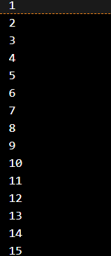
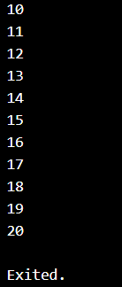
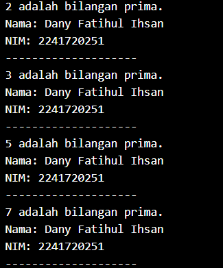

# Nama : Dany Fatihul Ihsan

# Kelas : TI3B / 06

## Praktikum 1 : Menerapkan Control Flows ("if/else")

### Langkah 1
Ketik atau salin kode program berikut ke dalam fungsi main().
```dart
String test = "test2";
if (test == "test1") {
    print("Test1");
} else if (test == "test2") {
    print("Test2");
} else {
    print("Something else");
}
if (test == "test2") print("Test2 again");
```

### Langkah 2
Silakan coba eksekusi (Run) kode pada langkah 1 tersebut. Apa yang terjadi? Jelaskan!


### Langkah 3
Tambahkan kode program berikut, lalu coba eksekusi (Run) kode Anda.

``` dart
String test = "true";
if (test) {
   print("Kebenaran");
}
```
Apa yang terjadi ? Jika terjadi error, silakan perbaiki namun tetap menggunakan if/else.

> yang terjadi adalah error
```dart
void main() {
  String test = "true";
  if (test == "true") {
    print("Kebenaran");
  } else {
    print("Something else");
  }
}
```

## Praktikum 2 : Menerapkan Perulangan "while" dan "do-while"

### Langkah 1
Ketik atau salin kode program berikut ke dalam fungsi main().
``` dart
while (counter < 33) {
  print(counter);
  counter++;
}
```

### Langkah 2
Silakan coba eksekusi (Run) kode pada langkah 1 tersebut. Apa yang terjadi? Jelaskan! Lalu perbaiki jika terjadi error.

> ketika saya run terjadi error yaitu variabel counter belum di inisialisasi

```dart
void main() {
  int counter = 1;
  while (counter < 33) {
    print(counter);
    counter++;
  }
}
```


### Langkah 3
Tambahkan kode program berikut, lalu coba eksekusi (Run) kode Anda.
``` dart
do {
  print(counter);
  counter++;
} while (counter < 77);
```
Apa yang terjadi ? Jika terjadi error, silakan perbaiki namun tetap menggunakan do-while.
> ketika saya run terjadi error yaitu variabel counter belum di inisialisasi
```dart
void main() {
  int counter = 1;
  do {
    print(counter);
    counter++;
  } while (counter < 77);
}
```




## Praktikum 3: Menerapkan Perulangan "for" dan "break-continue"

### Langkah 1
Ketik atau salin kode program berikut ke dalam fungsi main().
```dart
for (Index = 10; index < 27; index) {
  print(Index);
}
```

### Langkah 2
Silakan coba eksekusi (Run) kode pada langkah 1 tersebut. Apa yang terjadi? Jelaskan! Lalu perbaiki jika terjadi error.
> ketika saya run terjadi error yaitu variabel index belum di inisialisasi. Lalu untuk index ada yang I nya besar atau kecil jadi terjadi error.

```dart
void main() {
  int index;
  for (index = 10; index < 27; index++) {
    print(index);
  }
}
```


### Langkah 3
Tambahkan kode program berikut di dalam for-loop, lalu coba eksekusi (Run) kode Anda.
```dart
If (Index == 21) break;
Else If (index > 1 || index < 7) continue;
print(index);
```

Apa yang terjadi ? Jika terjadi error, silakan perbaiki namun tetap menggunakan for dan break-continue.
```dart
void main() {
  int index;
  for (index = 1; index < 27; index++) {
    if (index == 21)
      break;
    else if (index > 1 || index < 7) continue;
  }
  print(index);
}
```

## Tugas Praktikum
``` dart
void main() {
  String namaLengkap = 'Dany Fatihul Ihsan';
  String nim = '2241720251';

  bool isPrima(int number) {
    if (number < 2) return false;
    for (int i = 2; i <= number ~/ 2; i++) {
      if (number % i == 0) {
        return false;
      }
    }
    return true;
  }

  for (int i = 0; i <= 201; i++) {
    if (isPrima(i)) {
      print('$i adalah bilangan prima.');
      print('Nama: $namaLengkap');
      print('NIM: $nim');
      print('--------------------');
    }
  }
}
```

